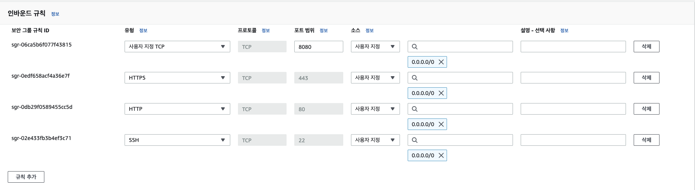

## EC2로 스프링 배포하기

먼저 EC2인스턴스를 Amazon Linux OS로 설정하고 생성합니다

pem키를 발급받고

인스턴스를 시작하고 연결 탭에 들어갑니다

스프링 부트는 기본적으로 내장 서버인 Tomcat으로 실행되고 Tomcat의 기본 포트번호는 8080이므로 aws의 보안 그룹에서 8080포트를 허용해주어야 외부에서 접근이 가능하다


launch-wizard-1을 선택 후 인바운드 규칙 탭을 눌러 인바운드 규칙 편집을 누른다



다음 화면에서 규칙 추가를 누른 후 사용자 지정 TCP로 지정하고 포트 범위를 8080으로 설정해준 뒤 규칙을 저장한다


터미널에 pem키가 있는 디렉토리로 이동 후 터미널에 ssh 클라이언트로 접속한다

접속한 후 

```sudo yum install java-17-amazon-corretto-devel```

명령어를 통해 JDK 17을 다운로드 받는다

```sudo yum install git -y```

명령어를 통해 깃을 설치한 후

```git clone https://github.com/KimTaeO/CI-CD_study.git```

를 통해 깃허브에 올라가 있는 스프링 프로젝트를 클론받습니다

그 다음 

```chmod +x ./gradlew```

명령어를 통해 gradle에 권한을 부여한 뒤

```./gradlew build```로
빌드를 하고 build 디렉토리가 성성되면

```java -jar build/libs/생성된파일.jar```

명령어를 사용하여 스프링 프로젝트를 시작합니다


```EC2의 퍼블릭 IPv4주소:8080(포트번호)```를 입력하여 접속하면


스프링에 구현된 페이지가 없을 때 뜨는 whitelabel error페이지가 띄워지며 스프링에 접속이 된 걸 확인할 수 있습니다